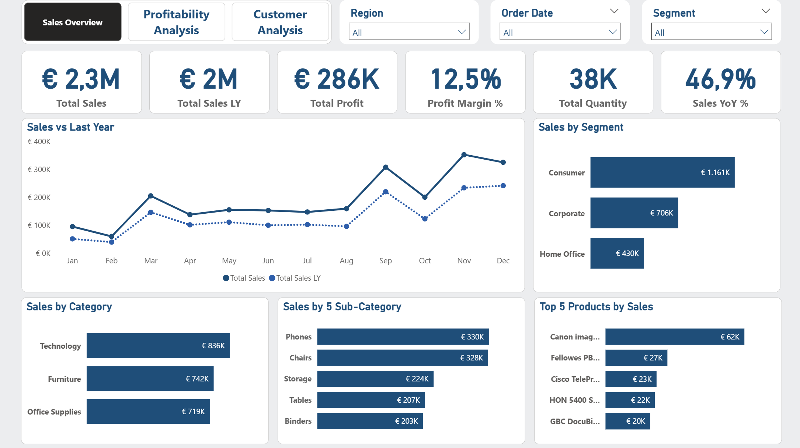
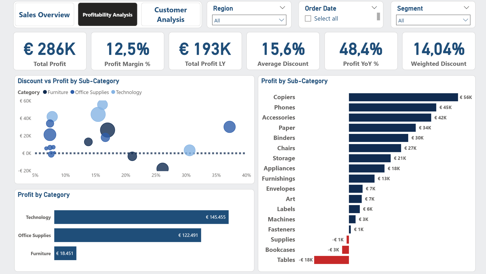
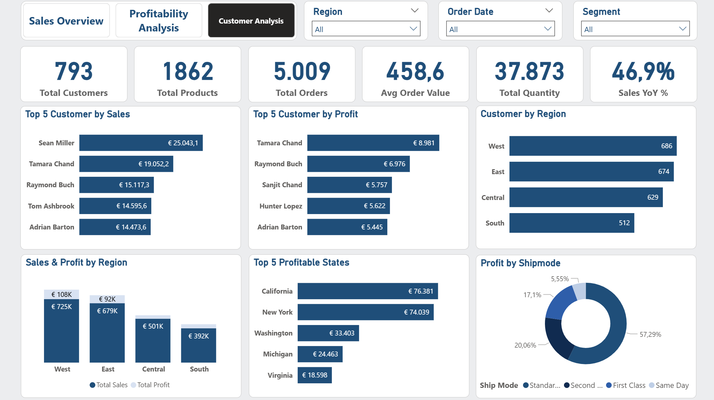
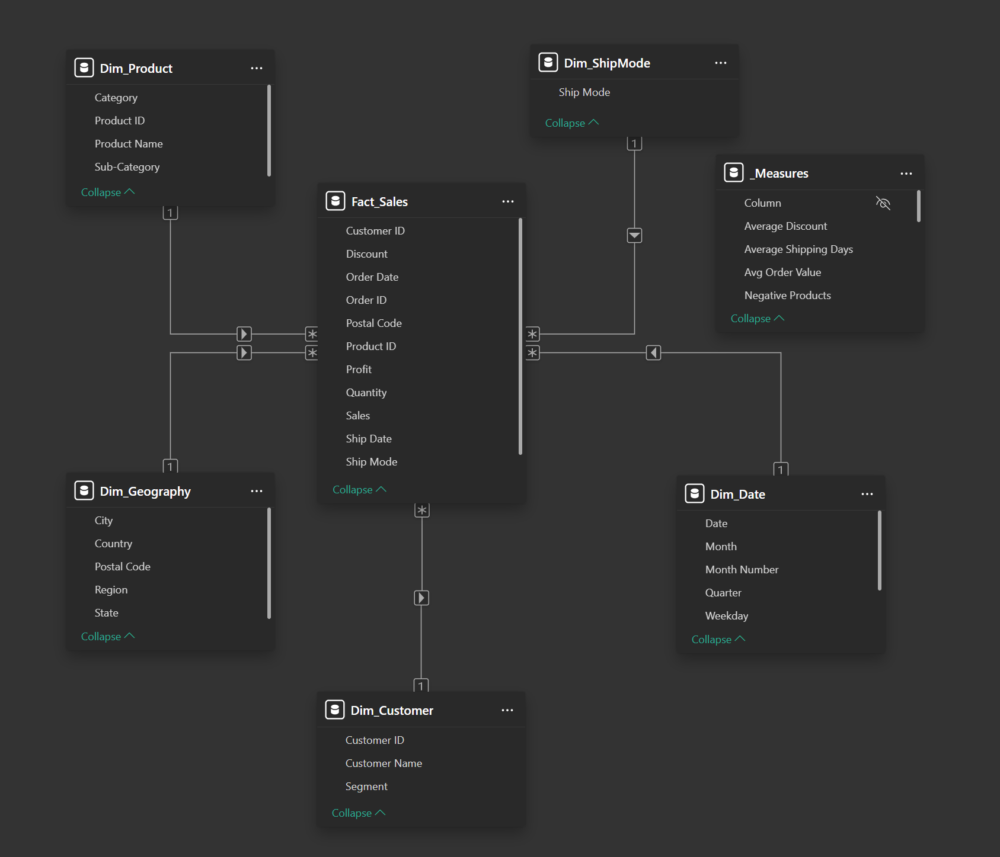

# Sales Performance Dashboard (Power BI)

## Project Overview

Retail companies collect large amounts of sales data every day. However, raw transaction data alone does not provide clear answers to important business questions such as:

- Are sales improving over time?
- Which products generate the most profit?
- How do discounts affect profitability?
- Which customers and regions drive revenue?

The goal of this project is to transform raw sales data into clear and actionable insights using Power BI.

The dashboard is structured into three analytical views:

- Sales Overview  
- Profitability Analysis  
- Customer Analysis  

---

## Dashboard Preview

### Sales Overview

### Profitability Analysis

### Customer Analysis

---

## Business Story

The dashboard is structured around three key business perspectives.  
Instead of only showing numbers, it tells a story about how the business performs, where profit comes from, and who the most valuable customers are.

---

### 1. Sales Overview

The first page provides a high-level overview of business performance.

It answers the question:

How is the business performing overall?

Key insights include:

- Total sales and profit  
- Sales growth compared to last year  
- Performance by customer segment  
- Category and product performance  
- Top selling products  

This page allows decision-makers to quickly understand sales trends and overall performance.

---

### 2. Profitability Analysis

Increasing sales does not always mean increasing profit. Discounts and product mix can strongly affect margins.

The Profitability Analysis page focuses on understanding:

- Which product categories generate the most profit  
- How discounts affect profitability  
- Which product groups are losing money  

One key visualization explores the relationship between discount levels and profit, helping identify cases where high discounts reduce margins.

This analysis highlights areas where profitability can be improved.

---

### 3. Customer Analysis

The final page focuses on customers and geographic performance.

It answers questions such as:

- Who are the most valuable customers?
- Which regions generate the highest sales?
- How is profit distributed geographically?

The analysis includes:

- Top customers by sales  
- Top customers by profit  
- Customer distribution by region  
- Sales and profit comparison across regions  
- Most profitable states  

This perspective helps businesses better understand customer value and regional opportunities.

---

## Data Model

To support efficient analysis, the dashboard uses a Star Schema data model, a common approach in business intelligence projects.

**Fact table**

- Fact_Sales  

**Dimension tables**

- Dim_Date  
- Dim_Product  
- Dim_Customer  
- Dim_Geography  
- Dim_ShipMode  

This structure enables flexible analysis across **products, customers, regions, and time**.

---

## Key Insights

Several insights can be identified from the analysis:

- The Technology category generates the highest profit
- Some sub-categories such as Tables and Bookcases generate negative profit, mainly due to high discounts
- The Consumer segment contributes the largest share of sales
- The West and East regions generate the highest revenue
- Standard shipping mode contributes the largest share of profit

These findings demonstrate how data can support better business decision-making.

---

## Tools Used

- Power BI  
- DAX (Data Analysis Expressions)  
- Data modeling using a Star Schema

---

## Skills Demonstrated

This project demonstrates several key data analysis skills:

- Data cleaning and preparation  
- Data modeling and table relationships  
- Creating calculated measures using DAX  
- Designing clear and intuitive dashboards  
- Analyzing sales, profitability, and customer behavior  
- Communicating insights through data visualization  

---

## About This Project

This dashboard was created as part of my data analytics portfolio to demonstrate practical experience with Power BI and business data analysis.

The focus of this project is not only building visualizations but also structuring analysis around real business questions and insights.
